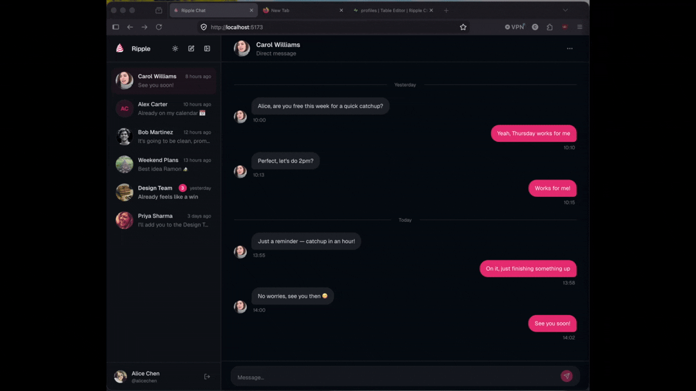

# Ripple Chat

A full-stack real-time messaging app built with React and Supabase. Designed to serve as a standalone starter or reference implementation for adding messaging to a larger project.



---

## About

I built a full-stack messaging feature as part of a larger university group project. Chat apps are always useful, so I thought given I'd done most of the work, I may as well componentise and extend the project. I chose to use Vite, React, TypeScript, and Supabase as they are commonly used, free, and support real-time.

---

## Features

- Real-time messaging (direct + group)
- Group chat management (create, rename, add/remove members, avatar)
- User search and new conversation flow
- Typing indicators
- Message deletion
- Read/unread tracking
- Block/unblock users
- Avatar upload
- Dark mode

---

## Tech Stack

| Layer     | Technology                            |
| --------- | ------------------------------------- |
| Framework | Vite                                  |
| UI        | React 19, TypeScript                  |
| Styling   | Tailwind CSS v4 (`@tailwindcss/vite`) |
| Fonts     | Geist (`@fontsource-variable/geist`)  |
| Auth      | Supabase                              |
| Database  | Supabase                              |

Supabase combines a Postgres database, auth, file storage, and Realtime subscriptions in one platform — meaning the server never needs to push message events, the client subscribes directly to database changes.

---

## Architecture

The app has no router — `App.tsx` renders either a login form or the messaging UI based purely on whether a Supabase session exists.

On load, the conversation list is fetched once, then kept live through a Realtime subscription to the `conversations` and `conversation_participants` tables. Any change (new message, group rename, being added or removed) silently refetches the list.

When a user opens a conversation, the 50 most recent messages are fetched and a second Realtime channel opens on the `messages` table for that thread. New messages arrive via push rather than polling.

The database handles bookkeeping via triggers — sending a message automatically updates the conversation's `last_message` preview and increments the unread count for every other participant. The client doesn't need to do this manually.

Opening a conversation resets the unread count via an RPC call, which clears the badge in the sidebar.

---

## Getting Started

### Prerequisites

- Node.js 18+
- A [Supabase](https://supabase.com/) account (free tier is fine)

### 1. Clone and install

```bash
git clone https://github.com/your-username/ripple-chat.git
cd ripple-chat
npm install
```

### 2. Set up Supabase

Create a new project in the Supabase dashboard, then copy your credentials:

```bash
cp .env.example .env
```

Fill in `VITE_SUPABASE_URL` and `VITE_SUPABASE_ANON_KEY` from **Project Settings → API**.

### 3. Run the database migrations

Using the Supabase CLI (recommended):

```bash
supabase link --project-ref your-project-ref
supabase db push
```

Or manually: paste the contents of each file in `supabase/migrations/` into the Supabase SQL editor in filename order.

### 4. Seed demo data (optional)

To populate the app with example users and conversations:

Add `SUPABASE_SERVICE_ROLE_KEY` to your `.env` (find it under **Project Settings → API → service_role** — never expose this in client code).

```bash
node supabase/seed.js
```

This creates 8 users (password: `password123` for all) with pre-existing conversations and realistic message history.

### 5. Run the dev server

```bash
npm run dev
```

---

## Known Limitations

- Mobile not optimised — desktop-first
- The UI is intentionally fairly minimal, designed to be integrated into a larger app where it will inherit that project's design system
- Unblock state requires a page refresh for the unblocked user
- Unread counts are seeded using a "last sent = last read" heuristic — accurate for demo purposes but not a true read-receipt system
